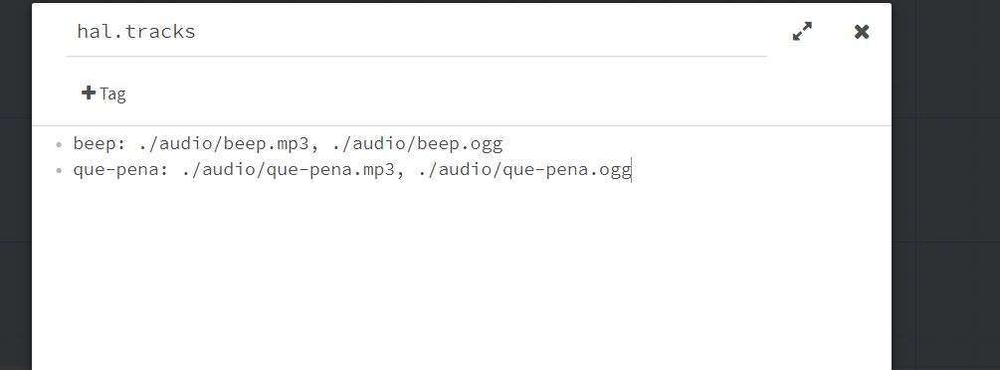

# What is HAL?

[Try out the demo.](./demo/ ':ignore')

HAL is an audio library for [Harlowe (v2.1.0 or higher)](https://twine2.neocities.org/) designed to give the format feature parity (or close to it) with [SugarCube's audio subsystem](http://www.motoslave.net/sugarcube/2/docs/#simpleaudio-api). This library was designed from the ground up *specifically* for use with Harlowe, and is intended to be as easy to use as possible for novice programmers without compromising functionality.

## Features

- All the core features you'd expect from such a library: playing across passages, fading, looping, individual track volume levels, etc.
- Support for audio playlists.
- Support for "audio groups," which let authors control track settings on groups of related tracks all at once.
- Includes an optional, user-configurable sidebar with built-in audio controls; specifically a master volume control and a master mute button.
- Supports preloading of audio, with an optional loading screen.
- Configurable and extensible for users who need it, with sane defaults and a bevy of built-in features for users who don't want to mess with any of that.

## Getting the Library

You can download any version of HAL from [here](https://github.com/ChapelR/harlowe-audio/releases). If you're just getting started, it's highly recommended that you grab the latest version. Once you've downloaded the library, you'll need to read the [guide](#guide) or the [documentation](v2) to learn how to use it.

There are two main version of HAL. The latest version 2 release is recommended for most users. If you're already using version 1 in your project, you don't have to update if you don't want to and can instead grab the latest version 1 release. The version 1 docs are [here](v1).

See [below](#guide) for a guide on the basics of using HAL.

## Quick Links

- [Downloads](https://github.com/ChapelR/harlowe-audio/releases)
- [Changelog](changelog)
- [Release Notes](https://twinelab.net/blog/tags/hal/)
- [Demo](https://hal.twinelab.net/demo/ ':ignore')
- [HAL v2 Complete Documentation](v2)
- [HAL v1 Complete Documentation](v1)

---

# Guide

This is a quick and dirty guide to getting HAL working. You're here for audio, and this guide aims to please. This library has a lot of other nice features you may need to come to grips with later, but for now, we'll focus on the bare minimum you'll need to know to take your story from a boring, soundless husk to grooving like it's 1999.

> [!NOTE]
> This guide is intended to get users up and running with HAL quickly and without too much fuss. It covers v2.0.0 and higher, [for v1, check out its docs](v1). For detailed reference documentation for v2, [click here](v2).

## Installing HAL in Twine 2

To install HAL, all you need is the code, which you can get [on the releases page of the repo](https://github.com/ChapelR/harlowe-audio/releases). You should choose the version with the highest version number. Download the `harlowe-audio.zip` file and unzip it. There should be three files, `harlowe-audio.min.js`, `harlowe-audio.min.css`, and `LICENSE`. Open the `harlowe-audio.min.js` file in a text editor, copy all of the contents, and paste it into your story JavaScript area in Twine 2. To find the story JavaScript area, click the up arrow next to your story's name in the editor (bottom left-hand side), then click the appropriate menu option.


You'll then do the same thing with the `harlowe-audio.min.css` file, pasting it into the story Stylesheet area instead.


> [!TIP]
> You should open these files in a **text editor**, not a word processor. Any text editor you have, like notepad, will work fine for this. Opening the file in a word processor may cause the code to stop working, as they sometimes convert certain characters into other characters on loading files&mdash;like turning normal quotes (&quot;...&quot;) into curly quotes (&ldquo;...&rdquo;)&mdash;that can mess up programming code.

Once all the code is in place, try playing your story. If you see a gray sidebar on the left with a white arrow at the top, and you don't encounter any errors popping up, you've installed it right!


## Defining Tracks

There are a few ways to define tracks, but the easiest (and recommended) way is with a *special passage* called `hal.tracks`.

> [!TIP]
> **What is a Special Passage?**
> A special passage is a concept from Twine 1 and SugarCube where certain passages with special names have meaning to the story format. Harlowe doesn't use special passages (though it does have [special tags](https://twine2.neocities.org/#section_passagetag)). All you need to know to create a special passage is what name to give it. So to make the special passage, create a new passage in your story and give it the name `hal.tracks`.



In this special passage you'll define each track on its own line. Tracks require a name and a list of URLs that point to audio files (that means they end with an audio extension, like `.mp3` or `.ogg`). You can give a track a number of source URLs; if you do, they should be the same track just in different file formats. If you only want to use one file format, `.mp3` is the safest bet. If you have the capability to create duplicates of the track in different formats, including both `.mp3` and `.ogg` versions is recommended, as that combination will give you the maximum possible browser support.

To define a track, list the track name first, then a colon, and finally one or more source URLs. If you include multiple source URLs, the list should be comma-separated (do not include trailing commas). You do not need to quote anything, not the track names or the source URLs.

Track names should only include letters (upper or lower case), numbers, dashes (`-`), underscores (`_`), and dollar signs (`$`). Other characters may work but are not officially supported. That's code for "don't use them even when they seem like they're working."

An example of a `hal.tracks` special passage that defines two tracks&mdash;a beeping sound called `beep` and a song called `que-pena`&mdash;might look like this:

```
beep: ./audio/beep.mp3, ./audio/beep.ogg
que-pena: ./audio/que-pena.mp3, ./audio/que-pena.ogg
```

Most projects will probably want to use [*relative* URLs](#defining-tracks-with-relative-urls) as shown above, but [absolute URLs](#defining-tracks-with-absolute-urls) are also supported. We'll get more into the weeds with these concepts in some [examples](#examples) later.

## Playing Tracks

On a basic level, all you need to do to play a track is have this code in a passage `(track: 'beep', 'play')`. However, [reality often resists simplicity](#autoplay-or-why-won39t-my-audio-work-on-the-first-passage).

This is the `(track:)` macro, and you give it the name of a track you've defined and a command to perform. Some commands accept additional arguments, which you can just pass to the macro after the command name. For example, to set a track to loop, you'd write `(track: 'que-pena', 'loop', true)`. This is because the *loop command* accepts an argument, which should be boolean `true` or `false`; `true` to set the track to loop, `false` to stop it from looping.

The lion's share of commands don't require any arguments, and very few commands require more than one, but when they do, they have to be given to the macro in the correct order, so you will need to check the docs for those.

If you just want a looping background track and that's it, define the track in the `hal.tracks` special passage, then place the following code in a [`startup`-tagged passage](https://twine2.neocities.org/#passagetag_startup) or in your first passage:

```
{
(track: 'track-name', 'loop', true)
(track: 'track-name', 'playwhenpossible')
}
```

> [!NOTE]
> When you write one of HAL's custom macros in the Twine 2 passage editor, it will show up colored in red like macros that don't exist. It is not possible for a library like this to edit Harlowe's syntax highlighting feature, so this is unfortunately impossible to fix. Just know that it's expected behavior and doesn't mean you did anything wrong.

## Examples

Now that you've got HAL installed and you know how to define a few tracks and play them, we'll cover a bunch of common use-cases here. To see more complex examples and use-cases, and learn more about what else you can do, look at the [reference documentation](v2).

### Defining Tracks with Absolute URLs

An *absolute URL* is a type of URL that basically tells a browser *exactly* where to find a resource, whereas a relative URL tells a browser where to find the resource *relative* to the file it's currently using. This might seem a bit confusing, but basically an absolute URL starts with `http://` or `https://` (prefer the latter whenever possible) and points to a file you're linking to somewhere on the web.

Here's our `hal.tracks` example from earlier, but with absolute links.

```
beep: https://example.com/audio/beep.mp3, https://example.com/audio/beep.ogg
que-pena: https://example.com/audio/que-pena.mp3, https://example.com/audio/que-pena.ogg
```

You can also use absolute links to point to a specific place in your computer's file system using the `file:///` protocol instead of `http://` or `https://`. Note that even on Windows systems, **use forward slashes in URLs**.

```
beep: file:///C:/twine/audio/beep.mp3, file:///C:/twine/audio/beep.ogg
que-pena: file:///C:/twine/audio/que-pena.mp3, file:///C:/twine/audio/que-pena.ogg
```

There are about a thousand reasons you *don't* want to use absolute URLs, even though they are convenient (more on that in the next example). Here's a few of those reasons:

- If the file is on the file system, users who download your game are going to have to go and place those files in exactly the same places on their systems. E.g., in the example above, a user would have to take your audio folder and literally manually place it in `C:` in a folder called `twine` or the audio just won't work.
- If the file is hosted on the web and served via `http://` or `https://`, your game will require a web connection for audio, even when it's being played offline.
- Whatever hosting service you use probably either serves an audio player rather than a file, or even if it does point to a file, it's probably against the Terms of Service of that website to *hot-link* to it. (Hot-linking is using someone else's website to host files for your website, and [it's widely frowned upon](https://tvtropes.org/pmwiki/pmwiki.php/Main/HotlinkedImageSwitch).)
- Relative URLs work basically everywhere, except, ironically, the two places arguably most important to Twine authors, in the Twine 2 application and on [philome.la](http://philome.la/), a free Twine game hosting service.

In the big scheme of things, unless you plan to upload to [philome.la](http://philome.la/), I recommend relative URLs, warts and all.

### Defining Tracks with Relative URLs

In our original example for defining tracks, we used relative links. Let's look at that again.

```
beep: ./audio/beep.mp3, ./audio/beep.ogg
que-pena: ./audio/que-pena.mp3, ./audio/que-pena.ogg
```

Translation: `./` means to look in the current folder the current HTML file is in. So the file `./audio/beep.mp3` means that we look in our current folder for a folder named `audio` and look in *that* folder for our `beep.mp3` file. In other words, the folder containing our game looks like this: 


Then, the inside of that `audio` folder looks like this:


When we want to share our game with friends, all we have to do is zip this folder up and email it. Or rename the game's HTML file to `index.html` and drop it on [itch.io](https://itch.io/). Or drop the whole folder onto your website (depending on how its made and where its hosted). Or send it through [web2executable](https://github.com/jyapayne/Web2Executable) to make it into a `.exe` file. In other words, its ready for anything. Except, as mentioned in the previous example, [philome.la](http://philome.la/) and, more distressingly, the Twine 2 app.

Twine 2's test and play modes run your story HTML file in memory, not from the file system. This means that it can't be relative to other files, it can only reference absolute URLs. You need to publish the game to file to be able to have a playable version with working audio.

There's two general options here: (1) use absolute URLs during development and then switch to relative URLs when you're ready to publish your game, or (2) just publish to file when you need to test the audio. Realistically, you don't have to have audio for every test play of your game during development.

The choice is yours, but I *strongly* recommend shipping your game with relative links unless you're targeting [philome.la](http://philome.la/) as your primary release platform.

### Autoplay (Or, Why Won't My Audio Work on the First Passage?)

If you dropped `(track: 'que-pena', 'play')` in your story's first passage, there is a pretty high chance that it didn't work. Most modern browsers do not allow audio to *autoplay*, which means that the audio starts before the user has interacted with the page. Once the user interacts with the page, clicking on a link or something, then you can play as much audio as you want.

There are three ways to get around this limitation.

#### 1. Use the `playwhenpossible` command.

The code `(track: 'que-pena', 'playwhenpossible')` will do two things. First and foremost, it'll attempt to play the track. If it detects that it cannot play the track, it will wait for the next valid user interaction, which should unlock autoplay, and then try to play the track again.

#### 2. Create a splash screen.

Your game's title, credits, logo, whatever. Having a passage the user has to click through in order to get to the "real" first passage will unlock autoplay for the rest of the game, and the `play` command should work on every passage after that first one.

#### 3. Tie the first track to a link.

Similar to the above, tying the `play` command to a link should work every time.

```
(link-repeat: 'Start the game.')[(track: 'que-pena', 'play')(goto: 'real first passage')]
```

### Stopping a Sound Before Playing Another

If you need to change tracks, that is, stop one and start another, you can use the `stop` command.

```
(track: 'theme', 'stop')
(track: 'que-pena', 'play')
```

This, of course, assumes you know which track is playing. If you don't you can instead run the `stop` command on the audio group `playing`, which will stop all currently playing tracks.

```
(group: 'playing', 'stop')
(track: 'que-pena', 'play')
```

Another way to stop all playing tracks is via the master audio command `stopall`.

```
(masteraudio: 'stopall')
(track: 'que-pena', 'play')
```

### Checking If a Sound Is Already Playing

You can test to see if a track is playing by combining an `(if:)` or `(unless:)` macro with the `(track:)` macro command `isplaying`:

```
(if: (track: 'que-pena', 'isplaying'))[
    The track is playing!
]
```

You may want to use this structure to check before playing a track if there's a chance the track could already be playing. For example, if there's a few different ways a user could get to a certain passage that starts playback of a track, you'd want to make sure it isn't already playing before running the `play` command.

```
(unless: (track: 'que-pena', 'isplaying'))[
    (track: 'que-pena', 'loop', true)
    (track: 'que-pena', 'play')
]
```

In fact, most times where music switches in your story from one background track to another, you'll probably want something that looks like this to cover all your bases:

```
(unless: (track: 'que-pena', 'isplaying'))[
    (group: 'playing', 'stop')
    (track: 'que-pena', 'loop', true)
    (track: 'que-pena', 'play')
]
```

### Playing Sounds with Links

You can wrap the `(track:)` macro to start playback of a track inside a `(link:)` macro (or one of its siblings).

```
{
(link-repeat: 'Honk the horn.')[
    (track: 'beep', 'play')
]
}
```


## This Is Only the Beginning

HAL has many other features, including master audio controls, playlists, and audio groups, and a variety of commands for all of it. You can also change the library's configuration settings, use JavaScript event handlers to plug into various audio events and even edit the sidebar to display a menu.

To learn more, check out [the reference documentation](v2). It's a bit drier and more technical than this guide, but it's worth reading if you have grander designs than what's been covered here.