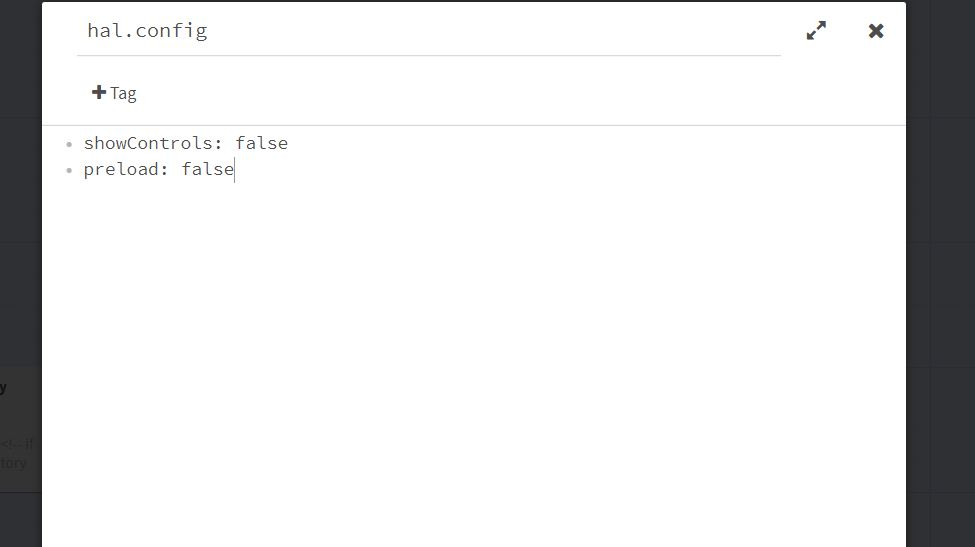
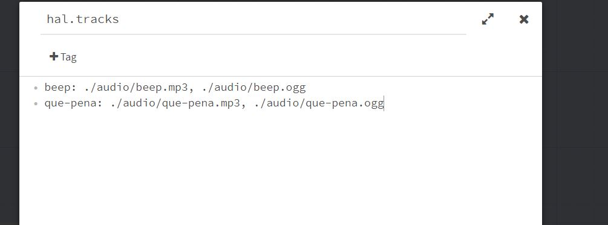

## Getting Started

[Try the Demo](./demo/ ':ignore')

### Introduction

This is an audio library designed for the [Twine 2](https://twinery.org/) story format [Harlowe (v2.1.0 or later)](https://twine2.neocities.org/). This documentation is for version 2 of HAL; documentation and downloads for [version 1 of HAL](v1) remain available for those who need them.

**Why a Second Major Version?**

HAL v2 fixes some of the issues of HAL v1, but the biggest change is the addition of macros and special passages to create a more user-friendly coding experience. JavaScript APIs are largely still available and very similar to their v1 counterparts, though some *have* changed in ways that may be counter to your expectations, so you'll want to review the documentation even if you're familiar with HAL v1 and planning on sticking to JavaScript.

**What Else Should I Know?**

This library uses [promises](https://developer.mozilla.org/en-US/docs/Web/JavaScript/Guide/Using_promises). That means Internet Explorer versions lower than 11 are out. Other than that, all major modern browsers should work fine, though the volume control may look odd in certain browsers--this can be fixed with user-supplied CSS code if necessary.

This library is free and dedicated to the public domain. That means you don't need to provide credit or attribution if you don't want to, and you can do anything you like with the code. [Review the license](https://github.com/ChapelR/harlowe-audio/blob/master/LICENSE) for any questions or concerns about that.

**I'm Having Trouble**

The best place to ask for help if the issue is on your end is [the Twine category on IntFiction.org](https://intfiction.org/c/authoring/twine), [the subreddit](https://www.reddit.com/r/twinegames/), or [the Discord server](https://discordapp.com/invite/n5dJvPp). If you suspect that the problem is in the code or otherwise on my end, [open an issue](https://github.com/ChapelR/harlowe-audio/issues/new).

**Donate**

> [!NOTE]
> I suggest donating to [Twine development](https://www.patreon.com/klembot) if you really want to help out, but I'd welcome a few dollars if you feel like it.

[](https://ko-fi.com/F1F8IC35)

### Installation

All you need to install this library is the code. Download the most recent version of HAL here, on the [releases page](https://github.com/ChapelR/harlowe-audio/releases). If you need to open one of the files to copy and paste it into your IDE or to make edits to the code, be sure to use a text editor, *not* a word processor.

Once you have the code, how you add it to your project will depend on the compiler and IDE you use.

- **In Twine 2 (online or standalone)**, copy and paste the code in `harlowe-audio.min.js` into your [Story JavaScript area](https://twinery.org/wiki/twine2:adding_custom_javascript_and_css), and the code in `harlowe-audio.min.css` into your Story Stylesheet area.

- **In Tweego or Entwine/Grunt-Entwine**, include the files in your command-line options or in your source code directory as appropriate. Remember to watch your file order, and refer to your compiler's docs if you need help.

- **In Twee2**, create a special passage with the `script` tag and place the JavaScript code in that passage, and do the same thing with the CSS and a `stylesheet` tag. Refer to its [docs](https://dan-q.github.io/twee2/documentation.html#twee2-syntax-special-passages) for more.

- **In Extwee**, at time of writing, you need to create special `script`- and `stylsheet`-tagged passages in your Twee code in much the same way as in Twee2. Future versions of Extwee may add directory support similar to Tweego/Entwine.

- **In other compilers or IDEs**, you'll need to refer to your program's documentation for how to add JavaScript and CSS code.

## Overview

HAL v2 allows authors to use either a (simple) JavaScript-based API or a set of custom macros for most operations. There are a handful of operations that can only be performed using the JavaScript API, but these are rare and probably not a major consideration for most authors. I recommend using whichever one you prefer.

> [!WARNING]
> HAL relies on a hack to gain access to Harlowe's `Macros` API, and uses other undocumented features of Harlowe's engine. This means that, particularly regarding custom macros, it's possible that future releases of Harlowe could break certain parts of HAL. While I'll always try to stay on top of fixes, it's possible that certain parts of the library may stop working with these future versions.

> [!TIP]
> HAL custom macros will show up in red in the Twine 2 passage editor, as if they don't exist. This is normal.

### Special Passages

A *special* passage is a normal passage with a specific name that has special meaning to the library. HAL supports two special passages.

#### The `hal.config` Special Passage

See: [Configuration](#configuration)

This special passage can be used to configure certain options within HAL.

#### The `hal.tracks` Special Passage

See: [The Track Definition Special Passage](#the-track-definition-special-passage)

This special passage can be used, in addition to or in place of the `(newtrack:)` macro or the `A.newTrack()` method, to define tracks.

### Custom Macros Overview

HAL comes with the following custom macros:

#### The `(newtrack:)` Macro

**Syntax:** `(newtrack: name, source [, source...])`

This macro is used to [define a track](#defining-tracks). You must give the track a name and at least one source URL that points to an audio file. You can give a track multiple source files to improve browser support.

**Arguments:**  
- `name` the name to give the track.
- `source` at least one source URL must be passed to the macro.

```
(newtrack: 'beep', './audio/beep.mp3', './audio/beep.ogg')
(newtrack: 'que-pena', './audio/que-pena.mp3', './audio/que-pena.ogg')
```

#### The `(newplaylist:)` Macro

**Syntax:** `(newplaylist: name, track [, track...])`

This macro is used to [define a playlist](#defining-playlists). You must give the playlist a name and a list of tracks.

**Arguments:**  
- `name` the name to give the playlist.
- `track` a number of tracks should be passed to playlist by name as individual arguments.

```
(newplaylist: 'bgm', 'que-pena', 'score', 'sad-song')
```

#### The `(newgroup:)` Macro

**Syntax:** `(newgroup: name, track [, track...])`

This macro is used to [define custom audio groups](#defining-groups). You must give the group a name and a list of tracks.

**Arguments:**  
- `name` the name to give the group.
- `track` a number of tracks should be passed to group by name as individual arguments.

```
(newgroup: 'ui-sounds', 'beep', 'no-beep', 'click')
```

#### The `(masteraudio:)` Macro

**Syntax:** `(masteraudio: command [, arguments])`

This macro is used to run [master audio commands](#master-audio-commands).

**Arguments:**  
- `command` the name of a master audio command.
- `arguments` (optional) the arguments passed to the command, if applicable.

```
(masteraudio: 'preload')
(masteraudio: 'stopall')
```

#### The `(track:)` Macro

**Syntax:** `(track: name, command [, arguments...])`

This macro is used to run [track commands](#track-commands).

**Arguments:**  
- `name` the name of a previously defined track.
- `command` the name of a track command.
- `arguments` a list of arguments to pass to the command

```
(track: 'beep', 'play')
(track: 'que-pena', 'loop', true)
```

#### The `(playlist:)` Macro

**Syntax:** `(playlist: name, command [, arguments...])`

This macro is used to run [playlist commands](#playlist-commands).

**Arguments:**  
- `name` the name of a previously defined playlist.
- `command` the name of a playlist command.
- `arguments` a list of arguments to pass to the command

```
(playlist: 'bgm', 'play')
(playlist: 'bgm', 'loop', true)
```

#### The `(group:)` Macro

**Syntax:** `(group: name, command [, arguments...])`

This macro is used to run [group commands](#group-commands).

**Arguments:**  
- `name` the name of a previously defined group.
- `command` the name of a group command.
- `arguments` a list of arguments to pass to the command

```
(group: 'ui-sounds', 'volume', 0.5)
(group: 'ui-sounds', 'mute', true)
```

### The JavaScript API Overview

An overview of JavaScript APIs available in HAL:

#### The `A` / `Chapel.Audio` Object

This object is the root object of the library, and contains several methods, most of which are master audio commands. If the `globalA` [configuration option](#configuration) is `false` or the `window.A` namespace is already taken, everything can be found on the `Chapel.Audio` object instead. We use the `A` namespace throughout this guide, but keep in mind that they are interchangeable.

#### The Tracks API

Tracks can be [defined](#defining-tracks) with the `A.newTrack()` method and accessed with the `A.track()` method so that you can run [track methods](#track-commands) on them.

---

**Syntax:** `A.newTrack(name, sourceList)`

**Arguments:**  
- `name` (*string*) the name to give the track.
- `sourceList` (*string*|*string array*) a list of source URLs, which may be provided as a number of individual arguments, or as a single array of strings.

**Example:**  
```
// sources passed as a series of arguments:
A.newTrack('beep', './audio/beep.mp3', './audio/beep.ogg');

// sources passed as a single array of strings:
A.newTrack('que-pena', ['./audio/que-pena.mp3', './audio/que-pena.ogg']);
```

---

**Syntax:** `A.track(name)`

**Returns:** a `Track` instance, which you can then run methods on.

**Arguments:**  
- `name` (*string*) the name of a previously defined track.

**Example:**  
```
A.track('beep').play();
A.track('que-pena').loop(true);
```

---

#### The Playlist API

Playlists can be [defined](#defining-playlists) with the `A.createPlaylist()` method and accessed with the `A.playlist()` method so that you can run [playlist methods](#playlist-commands) on them.

---

**Syntax:** `A.createPlaylist(name, trackList)`

**Arguments:**  
- `name` (*string*) the name to give the playlist.
- `trackList` (*string*|*string array*) a list of track names, which may be provided as a number of individual arguments, or as a single array of strings.

**Example:**  
```
// tracks passed as a series of arguments:
A.createPlaylist('bgm', 'que-pena', 'score', 'sad-song');

// tracks passed as a single array of strings:
A.createPlaylist('bgm', ['que-pena', 'score', 'sad-song']);
```

---

**Syntax:** `A.playlist(name)`

**Returns:** a `Playlist` instance, which you can then run methods on.

**Arguments:**  
- `name` (*string*) the name of a previously defined playlist.

**Example:**  
```
A.playlist('bgm').play();
A.playlist('bgm').loop(true);
```

---

#### The Group API

Groups can be [defined](#defining-groups) with the `A.createGroup()` method and accessed with the `A.group()` method so that you can run [group methods](#group-commands) on them.

---

**Syntax:** `A.createGroup(name, trackList)`

**Arguments:**  
- `name` (*string*) the name to give the group.
- `trackList` (*string*|*string array*) a list of track names, which may be provided as a number of individual arguments, or as a single array of strings.

**Example:**  
```
// tracks passed as a series of arguments:
A.createGroup('ui-sounds', 'beep', 'no-beep', 'click');

// tracks passed as a single array of strings:
A.createGroup('ui-sounds', ['beep', 'no-beep', 'click']);
```

---

**Syntax:** `A.group(name)`

**Returns:** a `Group` instance, which you can then run methods on.

**Arguments:**  
- `name` (*string*) the name of a previously defined group.

**Example:**  
```
A.playlist('ui-sounds').volume(0.5);
A.playlist('ui-sounds').mute(true);
```

---

#### Other APIs

See the [Additional JavaScript Features](additional-javascript-features) section for a complete list of additional APIs and features.

## Configuration

HAL has a variety of configuration options users can alter to fine tune the library to meet their needs. These options can be set using a *special passage*, which is a normal passage with a specific name that has meaning to the library. The special passage for configuring HAL must be named `hal.config`.



Each option is a property/value pair on its own line, with the property name appearing on the left, a colon, and then the property's value. For example, to set HAL's sidebar to start opened, you'd type:

```
sidebarStartClosed: false
```

To set the sidebar to start open and prevent the volume readout from appearing, you could type:

```
sidebarStartClosed: false
volumeDisplay: true
```

Options that you don't set remain at their default values.

> [!WARNING]
> The option names are **case-sensitive**, so `sidebarStartClosed` is not the same as `sidebarstartclosed`, and the latter *will not* work.

Below are a list of the options you can set in your configuration passage and their default values.

|Option|Default|Valid Options|Description|
|---|---|---|---|
|`preload`|`true`|`true` or `false`|Controls whether audio should be preloaded when the game is started, or if audio should only be loaded as needed. In most cases, you'll want to preload it. You can optionally include a loading screen by placing the `A.preload()` method or the macro command `(masteraudio: 'preload')` beneath your track definitions.|
|`loadDelay`|`0`|A number of milliseconds.|Causes the loading screen to hang for a configurable number of milliseconds after loading completes. Use this to fine tune for edge cases, or work around [FOUC issues](https://en.wikipedia.org/wiki/Flash_of_unstyled_content).|
|`muteOnBlur`|`true`|`true` or `false`|Setting this option to true causes the sound in your game to mute when the user is in another tab or window.|
|`startingVol`|`0.5`|A number between 0 and 1.|Sets the default starting master volume.|
|`persistPrefs`|`true`|`true` or `false`|The master volume and mute are considered user preferences, in that they are intended for users to adjust. You can use this option to cause changes to these settings to be saved and restored from local storage. For example, if the user sets the master volume to `0.3`, then closes the game, the master volume will be `0.3` rather than the `startingVol` next time they play the game.|
|`globalA`|`true`|`true` or `false`|By default, and throughout this guide, the JavaScript API is sent to the global scope as `A`, matching HAL v1 and Howler for Harlowe's way of doing things. If you don't want that, or if the `window.A` name is already taken, you can find everything at `Chapel.Audio` instead.|
|`showControls`|`true`|`true` or `false`|This library includes a control panel (as a sidebar) for users to control the master volume and mute state. You can determine whether or not you want to use it or roll your own (or not include options, you Philistine) with this option. If set to false the sidebar, controls, and associated APIs will be unavailable in your game.|
|`sidebarStartClosed`|`true`|`true` or `false`|The sidebar slides in and out from the side of the screen. By default it starts closed (taking up very little space) and needs to be opened by the user to be used. If you'd rather it start open, change this setting to `false`.|
|`volumeDisplay`|`false`|`true` or `false`|Determines whether a text readout of the current volume is displayed next to the volume control.|
|`trackLoadLimit`|`500`|A number of milliseconds.|Use this option to set a tolerance (in MS) for how long the preloading function will wait attempting to load a single track before moving on. In combination with the below option, this setting should be used to make sure the game doesn't just hang forever on slower connections.|
|`totalLoadLimit`|`8000`|A number of milliseconds.|Use this option to set a tolerance (in MS) for how long the preloading function will wait attempting to load all of the tracks before dismissing the load screen. In combination with the above option, this setting should be used to make sure the game doesn't just hang forever on slower connections.|
|`debug`|`false`|`true` or `false`|Logs a bunch of debug info to the console as HAL does its thing. Useful for writing extensions and otherwise hacking on HAL, should not be used for much outside of that. You definitely don't want it on when you ship your game.|

## Defining Tracks

### Parts of a Track Definition

Tracks are the meat-and-potatoes of an audio library, as you may expect. Tracks need to be given *names* so that you can call on them later, and one or more *source URLs* which point to audio files (e.g., the file name ends in an audio extension, like `.mp3` or `.ogg`). When you provide multiple sources to a track, HAL will automatically pick the first one in the list the browser can play and use that. Not all browsers support all audio file types. *Almost* every browser supports `mp3` files, but a few, like Chromium don't. Again, *almost* every browser also supports `ogg` files, but a few, like Safari, don't. This typically makes `mp3` and `ogg` files the best combination to use. If you only use one file type, try to use `mp3`s.

You can use [**absolute** or **relative** URLs](https://developer.mozilla.org/en-US/docs/Learn/Common_questions/What_is_a_URL#Absolute_URLs_vs_relative_URLs) as sources for your tracks. The URL you use should point to a file, not a web player; this makes some audio hosting services hard to use for multimedia hosting. If you do host your audio somewhere, review the Terms of Service of the service you use, as hot-linking may be forbidden.

Once you've got your source URLs squared away, there are three ways to define a track: using the `hal.tracks` special passage (recommended), using the `(newtrack:)` macro, and using the `A.newTrack()` method in JavaScript.

### The Track Definition Special Passage

The recommended way to define your tracks is through a special passage called `hal.tracks`.



After creating a passage and naming it `hal.tracks`, you can type in the name of the track, a colon, and then a list of source URLs separated by commas.

```
beep: ./audio/beep.mp3, ./audio/beep.ogg
que-pena: ./audio/que-pena.mp3, ./audio/que-pena.ogg
```

> [!DANGER]
> Track names may contain Latin letters (upper or lower cased), numbers, dashes, underscores, and dollar signs, but should not generally contain any other characters or symbols. Because of the way HAL parses the track definition special passage, track URLs must not contain commas. Most URLs do not and generally *should* not contain commas anyway, but if you need to use a URL with a comma for some reason and cannot change it, you will need to use a different method to define the track in question.

> [!WARNING]
> Parsing is not the fastest operation, so if your game takes an excessively long time to load or you are concerned about performance, it is recommended that you define your tracks in a different way. Note that the actual performance cost of the parsing operation would require potentially hundreds of tracks to introduce meaningful slowdown, however.

If you only have one source URL, that's fine too.

### Using the API or Macros

You can use the JavaScript API or the macro API to define tracks as well. Track definitions should happen early in your story; either in a `startup`-tagged passage or in your Story JavaScript.

<!-- tabs:start -->

##### **Macros**

**Syntax:** `(newtrack: name, source [, source...])`

**Arguments:**  
- `name` the name to give the track.
- `source` at least one source URL must be passed to the macro.

```
(newtrack: 'beep', './audio/beep.mp3', './audio/beep.ogg')
(newtrack: 'que-pena', './audio/que-pena.mp3', './audio/que-pena.ogg')
```

##### **JavaScript**

If you use JavaScript, either in a passage using a `<script>` tag or directly in your Story JavaScript, you will use the `A.newTrack()` method to define a new track.

**Syntax:** `A.newTrack(name, sourceList)`

**Arguments:**  
- `name` (*string*) the name to give the track.
- `sourceList` (*string*|*string array*) a list of source URLs, which may be provided as a number of individual arguments, or as a single array of strings.

**Example:**  
```
// sources passed as a series of arguments:
A.newTrack('beep', './audio/beep.mp3', './audio/beep.ogg');

// sources passed as a single array of strings:
A.newTrack('que-pena', ['./audio/que-pena.mp3', './audio/que-pena.ogg']);
```

<!-- tabs:end -->

Once you've defined all your tracks you're ready to play them! You'll put your tracks to use with [**track commands**](#track-commands), and can organize them using [playlists](#defining-playlists) and [groups](#defining-groups).

### Preloading Audio

By default, audio in HAL is *preloaded*, meaning tracks begin loading their source files when the game starts, not when the tracks are used. You can change this in the [configuration settings](#configuration), but this is *not* recommended.

You can show a loading screen to force the user to wait (in accordance with the loading limits set in the configuration settings) on non-mobile browsers by using the `A.preload();` method or the `(masteraudio: 'preload')` macro command. All tracks defined before this command is called (this includes all tracks defined in the `hal.tracks` special passage) will be loaded while a loading screen is shown.

<!-- tabs:start -->

##### **Macros**

To preload previously defined tracks, use the `(masteraudio:)` macro with the `preload` command.

```
(newtrack: 'beep', './audio/beep.mp3', './audio/beep.ogg')
(newtrack: 'que-pena', './audio/que-pena.mp3', './audio/que-pena.ogg')

(masteraudio: 'preload') <!-- a loading screen will be displayed while the above two tracks are loaded -->

(newtrack: 'boop', './audio/boop.mp3', './audio/boop.ogg') <!-- this track *may* finish loading in time, but will not cause the loading screen to continue if it isn't -->
```

##### **JavaScript**

To preload previously defined tracks, use the `A.preload()` method.

**Example:**  
```
A.newTrack('beep', './audio/beep.mp3', './audio/beep.ogg');
A.newTrack('que-pena', ['./audio/que-pena.mp3', './audio/que-pena.ogg']);

A.preload() // a loading screen will be displayed while the above two tracks are loaded

A.newTrack('boop', './audio/boop.mp3', './audio/boop.ogg'); // this track *may* finish loading in time, but will not cause the loading screen to continue if it isn't
```

<!-- tabs:end -->

Preloading audio with the loading screen has some benefits, but it's recommended that you:

1. don't use the loading screen feature at all if you don't need to, and  
2. if you do need to, only preload tracks that play early in the game or sound effects that need to match user interactions, like beeps when the user clicks links.

Neither of these features has any effect on mobile devices, since preloading audio on mobile is unwise on many levels.

## Track Commands

You can use the `(track:)` macro or the `A.track()` method to get a track. The macro version accepts a command and arguments directly in the macro, while the JavaScript version allows you to call methods directly on the returned track instance. The JavaScript methods can generally be chained unless they need to return a specific value.

> [!NOTE]
> Commands passed to macros are case-insensitive, so `play` and `PLaY` will both work.

<!-- tabs:start -->

##### **Macros**

**Syntax:** `(track: name, command [, arguments...])`

**Arguments:**  
- `name` the name of a previously defined track.
- `command` the name of a track command.
- `arguments` a list of arguments to pass to the command

```
(track: 'beep', 'play')
(track: 'que-pena', 'loop', true)
```

##### **JavaScript**

**Syntax:** `A.track(name)`

**Returns:** a `Track` instance, which you can then run methods on.

**Arguments:**  
- `name` (*string*) the name of a previously defined track.

**Example:**  
```
A.track('beep').play();
A.track('que-pena').loop(true);
```

<!-- tabs:end -->

### Playing, Pausing, and Stopping Tracks

> [!TIP]
> Playing tracks can be a bit more complex then it sounds, as autoplay (that is, playing any audio before the user interacts with the page) is not allowed on most modern browsers. To get around this, you can either use a splash screen (something the user has to click past at the start of your game, before any sound plays), tie your first sound to a link, or use the `playwhenpossible` command or the `track#playWhenPossible()` method.

<!-- tabs:start -->

##### **Macros**

Commands:  
- `play`: Plays the indicated track, if possible.
  - Arguments: none.
  - Returns: nothing.


- `playwhenpossible`: Plays the indicated track, is possible, or waits for a valid user interaction to start playback.
  - Arguments: none.
  - Returns: nothing.


- `isplaying`: Returns whether the indicated track is currently playing.
  - Arguments: none.
  - Returns: *boolean*.


- `stop`: Stops playback of the indicated track (pauses it and resets it).
  - Arguments: none.
  - Returns: nothing.


- `pause`: Pauses playback of the indicated track, if it's playing.
  - Arguments: none.
  - Returns: nothing.


```
<!-- play a track -->
(track: 'que-pena', 'play')

<!-- play a track when the user clicks a link -->
{
(link-repeat: 'Click me!')[
    (track: 'beep', 'play')
]
}

<!-- play a looping background track -->
(track: 'que-pena', 'loop', true)
(track: 'que-pena', 'play')

<!-- play a track when the ability to do so becomes unlocked -->
(track: 'que-pena', 'playwhenpossible')

<!-- play a track only if it isn't already playing -->
(unless: (track: 'que-pena', 'isplaying'))[
    (track: 'que-pena', 'play')
]

<!-- stop a track -->
(track: 'que-pena', 'stop')

<!-- pause a track -->
(track: 'que-pena', 'pause')
<!-- resume a paused a track -->
(track: 'que-pena', 'play')
```

##### **JavaScript**

Methods:  
- `track#play()`: Plays the track, if possible.
  - Arguments: none.
  - Returns: this track (chainable).
  

- `track#playWhenPossible()`: Plays the track, is possible, or waits for a valid user interaction to start playback.
  - Arguments: none.
  - Returns: this track (chainable).
  

- `track#isPlaying()`: Returns whether the track is currently playing.
  - Arguments: none.
  - Returns: *boolean*.
  

- `track#stop()`: Stops playback of the track (pauses it and resets it).
  - Arguments: none.
  - Returns: this track (chainable).
  

- `track#pause()`: Pauses playback of the track, if it's playing.
  - Arguments: none.
  - Returns: this track (chainable).
  

```
<!-- play a track -->
<script>A.track('que-pena').play()</script>

<!-- play a track when the user clicks a link -->
{
(link-repeat: 'Click me!')[
    <script>A.track('beep').play()</script>
]
}

<!-- play a looping background track -->
<script>A.track('que-pena').loop(true).play()</script>

<!-- play a track when the ability to do so becomes unlocked -->
<script>A.track('que-pena').playWhenPossible()</script>

<!-- play a track only if it isn't already playing -->
(unless: A.track('que-pena').isPlaying())[
    <script>A.track('que-pena').play()</script>
]

<!-- stop a track -->
<script>A.track('que-pena').stop()</script>

<!-- pause a track -->
<script>A.track('que-pena').pause()</script>
<!-- resume a paused a track -->
<script>A.track('que-pena').play()</script>
```

<!-- tabs:end -->

### Looping Tracks

A "looping" track is like hitting the "repeat" button on a music player; when a looping track ends, it will start over again from the beginning. 

> [!NOTE]
> Because HAL leverages the `HTMLMediaElements` API internally, it is not capable of true gapless playback--looped tracks will have a short stop between the end and the beginning that can not be removed.

<!-- tabs:start -->

##### **Macros**

Commands:  
- `loop`: Change the loop state of the indicated track.
  - Arguments:
    - (*boolean*) pass the value `true` to turn looping on, `false` to turn it off.
  - Returns: nothing.


- `toggleloop`: Toggle the loop state of the indicated track (setting it to `true` if it's false and vice versa).
  - Arguments: none.
  - Returns: nothing.


- `islooping`: Returns `true` if the indicated track is looping.
  - Arguments: none.
  - Returns: *boolean*.


```
<!-- set a track to loop and play it -->
(track: 'que-pena', 'loop', true)
(track: 'que-pena', 'play')

<!-- test to see if a track is looping -->
(if: (track: 'que-pena', 'islooping'))[
    The track is looping!
]

<!-- stop a track from looping -->
(track: 'que-pena', 'loop', false)

<!-- toggle the loop state of a track -->
(track: 'que-pena', 'toggleloop')
```

##### **JavaScript**

Methods:  
- `track#loop(bool)`: Change the loop state of the track.
  - Arguments:
    - `bool` (*boolean*) pass the value `true` to turn looping on, `false` to turn it off.
  - Returns: this track (chainable).


- `track#toggleLoop()`: Toggle the loop state of the track (setting it to `true` if it's false and vice versa).
  - Arguments: none.
  - Returns: this track (chainable).


- `track#isLooping()`: Returns `true` if the track is looping.
  - Arguments: none.
  - Returns: *boolean*.
  

```
<!-- set a track to loop and play it -->
<script>A.track('que-pena').loop(true).play()</script>

<!-- test to see if a track is looping -->
(if: A.track('que-pena').isLooping())[
    The track is looping!
]

<!-- stop a track from looping -->
<script>A.track('que-pena').loop(false)</script>

<!-- toggle the loop state of a track -->
<script>A.track('que-pena').toggleLoop()</script>
```

<!-- tabs:end -->

### Adjusting Time and Volume

You can adjust the time (called *seeking*) of a track as well as it's volume and mute states as well.

<!-- tabs:start -->

##### **Macros**

Commands:  
- `seek`: Change the time of the indicated track, moving to the indicated time for playback.
  - Arguments:
    - (*number*) pass a number of seconds; negative values will seek from the end of the track.
  - Returns: nothing.


- `mute`: Mute the indicated track.
  - Arguments:
    - (*boolean*) pass the value `true` to mute the track, `false` to unmute it. 
  - Returns: nothing.


- `togglemute`: Toggle the mute state of the indicated track (muting it if it isn't muted and vice versa).
  - Arguments: none. 
  - Returns: nothing.


- `ismuted`: Returns whether the indicated track is currently muted.
  - Arguments: none. 
  - Returns: *boolean*.


- `volume`: Sets the volume of the indicated track.
  - Arguments: 
    - (*number*) pass a number between 0 (silent) and 1 (full volume) to set the volume of a track.
  - Returns: nothing.


- `getvolume`: Returns the indicated track's current *own* volume--this does not account for the state of the master volume.
  - Arguments: none.
  - Returns: *number*.


```
<!-- seek to thirty seconds in then start playback of a track -->
(track: 'que-pena', 'seek', 30)
(track: 'que-pena', 'play')

<!-- mute a track -->
(track: 'que-pena', 'mute', true)

<!-- unmute a track -->
(track: 'que-pena', 'mute', false)

<!-- test to see if a track is muted -->
(if: (track: 'que-pena', 'ismuted'))[
    The track is muted!
]

<!-- toggle the mute state of a track -->
{
(link-repeat: 'Mute the BGM')[
    (track: 'que-pena', 'togglemute')
]
}

<!-- set a track's volume -->
(track: 'que-pena', 'volume', 0.5)

<!-- print a track's volume -->
(print: (track: 'que-pena', 'getvolume'))
```

##### **JavaScript**

Methods:  
- `track#seek(time)`: Change the time of the track, moving to the indicated time for playback.
  - Arguments:
    - `time` (*number*) pass a number of seconds; negative values will seek from the end of the track.
  - Returns: this track (chainable).


- `track#mute(bool)`: Mute the track.
  - Arguments:
    - `bool` (*boolean*) pass the value `true` to mute the track, `false` to unmute it. 
  - Returns: this track (chainable).


- `track#toggleMute()`: Toggle the mute state of the track (muting it if it isn't muted and vice versa).
  - Arguments: none. 
  - Returns: this track (chainable).


- `track#isMuted()`: Returns whether the track is currently muted.
  - Arguments: none. 
  - Returns: *boolean*.


- `track#volume(vol)`: Sets the volume of the track.
  - Arguments: 
    - `vol` (*number*) pass a number between 0 (silent) and 1 (full volume) to set the volume of a track.
  - Returns: this track (chainable).


- `track#getVolume()`: Returns the track's current *own* volume--this does not account for the state of the master volume.
  - Arguments: none.
  - Returns: *number*.
  

```
<!-- seek to thirty seconds in then start playback of a track -->
<script>A.track('que-pena').seek(30).play()</script>

<!-- mute a track -->
<script>A.track('que-pena').mute(true)</script>

<!-- unmute a track -->
<script>A.track('que-pena').mute(false)</script>

<!-- test to see if a track is muted -->
(if: A.track('que-pena').isMuted())[
    The track is muted!
]

<!-- toggle the mute state of a track -->
{
(link-repeat: 'Mute the BGM')[
    <script>A.track('que-pena').toggleMute()</script>
]
}

<!-- set a track's volume -->
<script>A.track('que-pena').volume(0.5)</script>

<!-- print a track's volume -->
(print: A.track('que-pena').getVolume())
```

<!-- tabs:end -->

### Fading Tracks

Tracks can be faded in, out, or over to new volume levels.

<!-- tabs:start -->

##### **Macros**

Commands:  
- `fadein`: Starts playback and fades the track's volume from silent to its current volume level over an indicated number of seconds.
  - Arguments:
    - (*number*) pass a number of seconds for the fade to last.
  - Returns: nothing.


- `fadeout`: Fades the track's volume from its current level to siltent over an indicated number of seconds, then stops playback.
  - Arguments:
    - (*number*) pass a number of seconds for the fade to last. 
  - Returns: nothing.


- `fadeto`: Fades the track's volume from its current level to the indicated level over an indicated number of seconds.
  - Arguments:
    - (*number*) pass a number of seconds for the fade to last. 
    - (*number*) pass a number between 0 and 1; this is the new volume the track will fade to.
  - Returns: nothing.


```
<!-- fade a track in over two seconds -->
(track: 'que-pena', 'fadein', 2)

<!-- fade a track out over five seconds -->
(track: 'que-pena', 'fadeout', 5)

<!-- fade a track's volume from 1 to 0.5 over three seconds -->
(track: 'que-pena', 'volume', 1)
(track: 'que-pena', 'play')
(track: 'que-pena', 'fadeto', 3, 0.5)

<!-- fade a track out and then fade a new one in -->
(track: 'score', 'fadeout', 2)
(live: 2s)[
    (stop:)
    (track: 'que-pena', 'fadein', 2)
]

<!-- crossfade two tracks -->
(track: 'score', 'fadeout', 2)
(track: 'que-pena', 'fadein', 2)
```

##### **JavaScript**

Methods:  
- `track#fadeIn(time)`: Starts playback and fades the track's volume from silent to its current volume level over an indicated number of seconds.
  - Arguments:
    - `time` (*number*) pass a number of seconds for the fade to last.
  - Returns: this track (chainable).


- `track#fadeOut(time)`: Fades the track's volume from its current level to siltent over an indicated number of seconds, then stops playback.
  - Arguments:
    - `time` (*number*) pass a number of seconds for the fade to last. 
  - Returns: this track (chainable).


- `track#fadeTo(time, vol)`: Fades the track's volume from its current level to the indicated level over an indicated number of seconds.
  - Arguments:
    - `time` (*number*) pass a number of seconds for the fade to last. 
    - `vol` (*number*) pass a number between 0 and 1; this is the new volume the track will fade to.
  - Returns: this track (chainable).


```
<!-- fade a track in over two seconds -->
<script>A.track('que-pena').fadeIn(2)</script>

<!-- fade a track out over five seconds -->
<script>A.track('que-pena').fadeOut(5)</script>

<!-- fade a track's volume from 1 to 0.5 over three seconds -->
<script>A.track('que-pena').volume(1).play().fadeTo(3, 0.5)</script>

<!-- fade a track out and then fade a new one in -->
<script>A.track('score').fadeOut(2)</script>
(live: 2s)[
    (stop:)
    <script>A.track('que-pena').fadeIn(2)</script>
]

<!-- crossfade two tracks -->
<script>
    A.track('score').fadeIn(2);
    A.track('que-pena').fadeIn(2);
</script>
```

<!-- tabs:end -->

## Master Audio Commands

Master audio commands and methods effect *all* of the playback happening in the game. You can use these methods to preload audio tracks, stop all audio from playing, or adjust the master mute and master volume settings.

<!-- tabs:start -->

##### **Macros**

**Syntax:** `(masteraudio: command [, arguments])`

**Arguments:**  
- `command` the name of a master audio command.
- `arguments` (optional) the arguments passed to the command, if applicable.

```
(masteraudio: 'preload')
(masteraudio: 'stopall')
```

##### **JavaScript**

**Syntax:** `A`

The master audio methods are simply static methods of the `A` or `Chapel.Audio` object.

**Example:**  
```
A.preload();
A.stopAll();
```

<!-- tabs:end -->

### Master Volume and Mute Settings

> [!NOTE]
> Master audio volume and mute settings are considered *user controls*, and are, by default, persisted between game sessions. Generally speaking, users, not developers, should be adjusting these controls.

<!-- tabs:start -->

##### **Macros**

Commands:  
- `volume`: Sets the master volume. The master volume effects all tracks.
  - Arguments:
    - (*number*) a number, between 0 and 1, to set the master volume to.
  - Returns: nothing.


- `getvolume`: Returns the current master volume level.
  - Arguments: none.
  - Returns: *number*.


- `mute`: Changes the master mute setting. The master mute setting overrides track mute settings when turned on, and defers to track mute settings when turned off. In other words, if the master mute setting is on, all tracks are effectively muted, but when it's off, individual tracks may or may not still be muted.
  - Arguments:
    - (*boolean*) pass `true` to mute, `false` to unmute. 
  - Returns: nothing.


- `ismuted`: Returns whether the master audio mute setting is on or off.
  - Arguments: none.
  - Returns: *boolean*.


```
<!-- create a link that toggles the master mute -->
{
(link-repeat: 'Mute')[
    (if: (masteraudio: 'ismuted'))[
        (masteraudio: 'mute', false)
    ](else:)[
        (masteraudio: 'mute', true)
    ]
]
}

<!-- set the master volume to 0.5 -->
(masteraudio: 'volume', 0.5)

<!-- print the current master volume -->
(print: (masteraudio: 'getvolume'))
```

##### **JavaScript**

Methods:  
- `A.volume(vol)`: Sets the master volume. The master volume effects all tracks.
  - Arguments:
    - `vol` (*number*) a number, between 0 and 1, to set the master volume to.
  - Returns: nothing.


- `A.getvolume()`: Returns the current master volume level.
  - Arguments: none.
  - Returns: *number*.


- `A.mute(bool)`: Changes the master mute setting. The master mute setting overrides track mute settings when turned on, and defers to track mute settings when turned off. In other words, if the master mute setting is on, all tracks are effectively muted, but when it's off, individual tracks may or may not still be muted.
  - Arguments:
    - `bool` (*boolean*) pass `true` to mute, `false` to unmute. 
  - Returns: nothing.


- `A.isMuted()`: Returns whether the master audio mute setting is on or off.
  - Arguments: none.
  - Returns: *boolean*.


```
<!-- create a link that toggles the master mute -->
{
(link-repeat: 'Mute')[
    (if: A.isMuted())[
        <script>A.mute(false)</script>
    ](else:)[
        <script>A.mute(true)</script>
    ]
]
}

<!-- set the master volume to 0.5 -->
<script>A.volume(0.5)</script>

<!-- print the current master volume -->
(print: A.getVolume())
```

<!-- tabs:end -->

### Other Commands and Methods

<!-- tabs:start -->

##### **Macros**

Commands:  
- `stopall`: Stops all currently playing audio.
  - Arguments: none.
  - Returns: nothing.


- `isplaying`: Returns whether any audio is currently playing.
  - Arguments: none.
  - Returns: *boolean*.


- `preload`: Extends the loading screen while all previously defined tracks preload. Only works in a startup-tagged passage or the first passage of the story. See: [Preloading Audio](#preloading-audio).
  - Arguments: none.
  - Returns: nothing.


```
<!-- stop all playing audio -->
(masteraudio: 'stopall')

<!-- check if any audio is playing -->
(unless: (masteraudio: 'isplaying'))[
    It's quiet... Too quiet.
]

<!-- preload all previously defined tracks -->
(masteraudio: 'preload')
```

##### **JavaScript**

Methods:  
- `A.stopAll()`: Stops all currently playing audio.
  - Arguments: none.
  - Returns: nothing.


- `A.audioPlaying()`: Returns whether any audio is currently playing.
  - Arguments: none.
  - Returns: *boolean*.


- `A.preload()`: Extends the loading screen while all previously defined tracks preload. Only works in your story JavaScript, a startup-tagged passage, or the first passage of the story. See: [Preloading Audio](#preloading-audio).
  - Arguments: none.
  - Returns: nothing.


```
<!-- stop all playing audio -->
<script>A.stopAll()</script>

<!-- check if any audio is playing -->
(unless: A.audioPlaying())[
    It's quiet... Too quiet.
]

<!-- preload all previously defined tracks -->
<script>A.preload()</script>
```

<!-- tabs:end -->

## Defining Playlists

You can define playlists using the `(newplaylist:)` macro or the `A.createPlaylist()` method. A playlist is an ordered collection of tracks used to play those tracks one after the other. Playlists can also be shuffled and can be looped--a playlist loop differs from a track loop: the playlist will play all of its tracks through once and then start over from the first track when looped.

Playlists differ from [groups](#defining-groups) in that groups are intended to create distinct audio subsets--music, sound effects, etc, that can be controlled in unison, while playlists are tracks that are meant to be played in some sort of order together.

A playlist must be given a name and a set of track names, in order.

> [!TIP]
> **Playlists as groups.**
>
> Groups have a few commands and methods playlists don't. If you want to use group commands on a playlist, you don't need to define both a group and a playlist, just pass the group a value list this: `playlist:listName`, to use it as a group.

<!-- tabs:start -->

##### **Macros**

**Syntax:** `(newplaylist: name, track [, track...])`

**Arguments:**  
- `name` the name to give the playlist.
- `track` a number of tracks should be passed to playlist by name as individual arguments.

```
(newplaylist: 'bgm', 'que-pena', 'score', 'sad-song')
```

##### **JavaScript**

**Syntax:** `A.createPlaylist(name, trackList)`

**Arguments:**  
- `name` (*string*) the name to give the playlist.
- `trackList` (*string*|*string array*) a list of track names, which may be provided as a number of individual arguments, or as a single array of strings.

**Example:**  
```
// tracks passed as a series of arguments:
A.createPlaylist('bgm', 'que-pena', 'score', 'sad-song');

// tracks passed as a single array of strings:
A.createPlaylist('bgm', ['que-pena', 'score', 'sad-song']);
```

<!-- tabs:end -->

Once you've defined a playlist, you can act on it using the `(playlist:)` macro or the `A.playlist()` method in much the same way as you'd act on tracks.

## Playlist Commands

You can use the `(playlist:)` macro or the `A.playlist()` method to get a playlist. The macro version accepts a command and arguments directly in the macro, while the JavaScript version allows you to call methods directly on the returned playlist instance. The JavaScript methods can generally be chained unless they need to return a specific value.

<!-- tabs:start -->

##### **Macros**

**Syntax:** `(playlist: name, command [, arguments...])`

**Arguments:**  
- `name` the name of a previously defined playlist.
- `command` the name of a playlist command.
- `arguments` a list of arguments to pass to the command

```
(playlist: 'bgm', 'play')
(playlist: 'bgm', 'loop', true)
```

##### **JavaScript**

**Syntax:** `A.playlist(name)`

**Returns:** a `Playlist` instance, which you can then run methods on.

**Arguments:**  
- `name` (*string*) the name of a previously defined playlist.

**Example:**  
```
A.playlist('bgm').play();
A.playlist('bgm').loop(true);
```

<!-- tabs:end -->

### Playing, Pausing, and Stopping Playlists

> [!TIP]
> Playlists do not have an equivalent to the `playwhenpossible` [track command](#track-commands), so you'll need to make sure the user interacts with the page in some way before playing a playlist.

<!-- tabs:start -->

##### **Macros**

Commands:  
- `play`: Starts playback of the indicated playlist. When a track ends, the next track is played until the last one is reached. If the playlist is set to loop, it will start over, otherwise playback will end when the last track ends.
  - Arguments:
    - (*number*) you can pass a number to start the playlist at a different track than the first. Playlists are zero-based, so the first track in a playlist is `0`, the second is `1`, and so on.
  - Returns: nothing.


- `pause`: Pauses the playback of the indicated playlist.
  - Arguments: none.
  - Returns: nothing.


- `stop`: Stops playback of the indicated playlist. This pauses the current track and resets it, and resets the playlist.
  - Arguments: none.
  - Returns: nothing.


- `isplaying`: Returns whether the indicated playlist is currently playing.
  - Arguments: none.
  - Returns: *boolean*.


```
<!-- start playback of a playlist at the first track -->
(playlist: 'bgm', 'play')

<!-- start playback of a playlist at the third (note that the number is 2, as the list is zero-based) track -->
(playlist: 'bgm', 'play', 2)

<!-- pause playback of a playlist -->
(playlist: 'bgm', 'pause')

<!-- stop playback of a playlist -->
(playlist: 'bgm', 'stop')

<!-- check if the playlist is already playing, if not, play it -->
(if: (playlist: 'bgm', 'isplaying'))[
    (playlist: 'bgm', 'play')
]
```

##### **JavaScript**

Methods:  
- `playlist#play(trackNum)`: Starts playback of the playlist. When a track ends, the next track is played until the last one is reached. If the playlist is set to loop, it will start over, otherwise playback will end when the last track ends.
  - Arguments:
    - `trackNum` (*number*) you can pass a number to start the playlist at a different track than the first. Playlists are zero-based, so the first track in a playlist is `0`, the second is `1`, and so on.
  - Returns: this playlist (chainable).


- `playlist#pause()`: Pauses the playback of the playlist.
  - Arguments: none.
  - Returns: this playlist (chainable).


- `playlist#stop()`: Stops playback of the playlist. This pauses the current track and resets it, and resets the playlist.
  - Arguments: none.
  - Returns: this playlist (chainable).


- `playlist#isPlaying()`: Returns whether the playlist is currently playing.
  - Arguments: none.
  - Returns: *boolean*.


```
<!-- start playback of a playlist at the first track -->
<script>A.playlist('bgm').play()</script>

<!-- start playback of a playlist at the third (note that the number is 2, as the list is zero-based) track -->
<script>A.playlist('bgm').play(2)</script>

<!-- pause playback of a playlist -->
<script>A.playlist('bgm').pause()</script>

<!-- stop playback of a playlist -->
<script>A.playlist('bgm').stop()</script>

<!-- check if the playlist is already playing, if not, play it -->
(if: A.playlist('bgm').isPlaying())[
    <script>A.playlist('bgm').play()</script>
]
```

<!-- tabs:end -->

### Looping Playlists

Playlists can be looped. Unlike tracks, this works more like the "repeat all" option on a music player. When a playlist is set to loop, it starts over from the beginning of the first track once the last track has finished playing.

<!-- tabs:start -->

##### **Macros**

Commands:  
- `loop`: Sets the indicated playlist to loop. Once the last track finished playing, the first track will start again from the beginning.
  - Arguments:
    - (*boolean*) pass `true` to make the playlist loop, `false` to stop it from looping.
  - Returns: nothing.


- `islooping`: Returns whether the indicated playlist is set to loop.
  - Arguments: none.
  - Returns: *boolean*.


```
<!-- set a playlist to loop and start playback -->
(playlist: 'bgm', 'loop', true)
(playlist: 'bgm', 'play')

<!-- stop a playlist from looping -->
(playlist: 'bgm', 'loop', false)

<!-- set a playlist to loop only if it isn't already -->
(if: (playlist: 'bgm', 'islooping'))[
    (playlist: 'bgm', 'loop', true)
]
```

##### **JavaScript**

Methods:  
- `playlist#loop(bool)`: Sets the playlist to loop. Once the last track finished playing, the first track will start again from the beginning.
  - Arguments:
    - `bool` (*boolean*) pass `true` to make the playlist loop, `false` to stop it from looping.
  - Returns: this playlist (chainable).


- `playlist#isLooping()`: Returns whether the playlist is set to loop.
  - Arguments: none.
  - Returns: *boolean*.


```
<!-- set a playlist to loop and start playback -->
<script>A.playlist('bgm').loop(true).play()</script>

<!-- stop a playlist from looping -->
<script>A.playlist('bgm').loop(false)</script>

<!-- set a playlist to loop only if it isn't already -->
(if: A.playlist('bgm').isLooping())[
    <script>A.playlist('bgm').loop(true)</script>
]
```

<!-- tabs:end -->

### Shuffling and Randomizing Playlists

You can also shuffle a playlist, which randomizes its order, or, using the JavaScript API, pick a single track from a playlist at random.

<!-- tabs:start -->

##### **Macros**

Commands:  
- `shuffle`: Randomizes the order of a playlist.
  - Arguments: none.
  - Returns: nothing.


```
<!-- shuffle the playlist and play it -->
(playlist: 'bgm', 'shuffle')
(playlist: 'bgm', 'play')
```

##### **JavaScript**

Methods:  
- `playlist#shuffle()`: Randomizes the order of a playlist.
  - Arguments: none.
  - Returns: this playlist (chainable).


- `playlist#random()`: Return a random track from the playlist, which can then be used with track methods.
  - Arguments: none.
  - Returns: a `Track` instance.


```
<!-- shuffle the playlist and play it -->
<script>A.playlist('bgm').shuffle().play()</script>

<!-- play a random track from a playlist -->
<script>A.playlist('bgm').random().play()</script>
```

<!-- tabs:end -->

## Defining Groups

Groups are ways to collect and organize tracks, but should not be confused with [playlists](#defining-playlists). These are designed to allow you to select and control a large number of tracks and do something to them. The methods used by groups are very similar to some of the track methods, but as said, do something to all of them at once.

There are two built-in groups, `playing` and `looping`, that can be used to control all currently playing or looping tracks, respectively. Additionally, you can define your own groups with the macro `(newgroup:)` or the method `A.createGroup()`.

You can also grab playlists and use group methods on them using the syntax `playlist:listName`. For example, if you have a playlist named `bgm`, you could target it with group commands like this `(group: 'playlist:bgm', stop)` or `A.group('playlist:bgm').stop()`.

<!-- tabs:start -->

##### **Macros**

**Syntax:** `(newgroup: name, track [, track...])`

**Arguments:**  
- `name` the name to give the group.
- `track` a number of tracks should be passed to group by name as individual arguments.

```
(newgroup: 'ui-sounds', 'beep', 'no-beep', 'click')
```

##### **JavaScript**

**Syntax:** `A.createGroup(name, trackList)`

**Arguments:**  
- `name` (*string*) the name to give the group.
- `trackList` (*string*|*string array*) a list of track names, which may be provided as a number of individual arguments, or as a single array of strings.

**Example:**  
```
// tracks passed as a series of arguments:
A.createGroup('ui-sounds', 'beep', 'no-beep', 'click');

// tracks passed as a single array of strings:
A.createGroup('ui-sounds', ['beep', 'no-beep', 'click']);
```

<!-- tabs:end -->

## Group Commands

You can use the `(group:)` macro or the `A.group()` method to get a group. The macro version accepts a command and arguments directly in the macro, while the JavaScript version allows you to call methods directly on the returned group instance. The JavaScript methods can generally be chained unless they need to return a specific value.

<!-- tabs:start -->

##### **Macros**

**Syntax:** `(group: name, command [, arguments...])`

**Arguments:**  
- `name` the name of a previously defined group.
- `command` the name of a group command.
- `arguments` a list of arguments to pass to the command

```
(group: 'ui-sounds', 'volume', 0.5)
(group: 'ui-sounds', 'mute', true)
```

##### **JavaScript**

**Syntax:** `A.group(name)`

**Returns:** a `Group` instance, which you can then run methods on.

**Arguments:**  
- `name` (*string*) the name of a previously defined group.

**Example:**  
```
A.playlist('ui-sounds').volume(0.5);
A.playlist('ui-sounds').mute(true);
```

<!-- tabs:end -->

The group commands are a subset of track commands, and accept the same arguments and perform the same actions. The commands are:

|Command|Description|Macro Example|JavaScript Example|
|---|---|---|---|
|`play`|Attempts to start playback every sound in the group. At once. Probably not useful, but included for completeness.|`(group: 'ui-sounds', 'play')`|`A.group('ui-sounds').play()`|
|`pause`|Pauses all the tracks in the group.|`(group: 'ui-sounds', 'pause')`|`A.group('ui-sounds').pause()`|
|`stop`|Stops all the tracks in the group.|`(group: 'ui-sounds', 'stop')`|`A.group('ui-sounds').stop()`|
|`mute`|Mutes or unmutes every track in the group.|`(group: 'ui-sounds', 'mute', true)`|`A.group('ui-sounds').mute(true)`|
|`volume`|Sets the volume level of every track in the group.|`(group: 'ui-sounds', 'volume', 0.5)`|`A.group('ui-sounds').volume(0.5)`|
|`loop`|Sets all tracks in the group to loop or not loop.|`(group: 'ui-sounds', 'loop', true)`|`A.group('ui-sounds').loop(true)`|

## Detailed Examples

The following section will provide detailed examples and explanations of common use-cases.

### Loading Audio Over the Network

You can use any URL that points to an audio file (i.e. they end in an audio file extension like `.wav` or `.ogg`) to set up a track. For example:

<!-- tabs:start -->

##### **Macros**

```
(newtrack: 'theme', 'http://www.kozco.com/tech/piano2.wav', 'http://www.kozco.com/tech/piano2.aif')
```

##### **JavaScript**

```javascript
A.newTrack('theme', 'http://www.kozco.com/tech/piano2.wav', 'http://www.kozco.com/tech/piano2.aif');
```

<!-- tabs:end -->

You can also use the [track definition special passage](#track-definition-special-passage) by creating a passage, naming it `hal.tracks`, and adding text like the following:

```
theme: http://www.kozco.com/tech/piano2.wav, http://www.kozco.com/tech/piano2.aif
```

### Loading Audio with Relative Paths

You can load audio with a **relative path**. A relative path is one that is resolved from where your file is located. Here's an [explanation](https://developer.mozilla.org/en-US/docs/Learn/Common_questions/What_is_a_URL#Absolute_URLs_vs_relative_URLs). Note that relative paths will only work with published HTML files--they won't work correctly from the Twine 2 application's test and play modes.

<!-- tabs:start -->

##### **Macros**

```
(newtrack: 'beep', 'audio/beep.mp3', 'audio/beep.ogg')
(newtrack: 'cool-song', 'audio/cool.mp3', 'audio/cool.ogg')
(newtrack: 'techno', 'audio/techno.mp3', 'audio/techno.ogg')
```

##### **JavaScript**

```javascript
A.newTrack('beep', 'audio/beep.mp3', 'audio/beep.ogg');
A.newTrack('cool-song', 'audio/cool.mp3', 'audio/cool.ogg');
A.newTrack('techno', 'audio/techno.mp3', 'audio/techno.ogg');
```

<!-- tabs:end -->

You can also use the [track definition special passage](#track-definition-special-passage) by creating a passage, naming it `hal.tracks`, and adding text like the following:

```
beep: audio/beep.mp3, audio/beep.ogg
cool-song: audio/cool.mp3, audio/cool.ogg
techno: audio/techno.mp3, audio/techno.ogg
```


[More information on adding media to your Twine game.](https://twinery.org/wiki/twine2:add_an_image_movie_sound_effect_or_music)

### Preloading Sound

See: [Preloading Audio](#preloading-audio)

By default, [the `preload` configuration option](#configuration) is `true`, and your game will attempt to preload all the audio it needs. This will make the game feel unresponsive and strange until loading completes. You can show a loading screen during this time by using the `A.preload()` method or the `(masteraudio: 'preload')` command, which may be preferable to an unresponsive page.

You can speed up initial loading and skip that sloppiness altogether by shutting off preloading, but the risk there is that sounds won't be ready when they're called the first time. That nice crisp beep when you click? Half a second late. The awesome theme tune timed to a slick CSS animation? Not so slick now.

Regardless, on subsequent plays, a given user shouldn't have either problem, as the data should be cached in their browser.

### Autoplaying Sound

**Autoplaying** refers to playing a sound (or video) *before* the user interacts with a page. Autoplaying is widely considered annoying, especially on mobiles. However, you've made a game--most users will expect autoplaying sound! It doesn't matter to most browser manufacturers.

There's no way to fake out autoplay, but once your document has permission to play a single sound, autoplay will work from then on out.

For example, if the following is how you play your first bit of audio, it won't work in some browsers:

<!-- tabs:start -->

##### **Macros**

```
(track: 'theme', 'play')
```

##### **JavaScript**

```
<script>A.track('theme').play();</script>
```

<!-- tabs:end -->

You have two options. The first is to simply tie the first sound you play to a `(link:)` of some kind. You may want to add a splash screen to your story to do this:

<!-- tabs:start -->

##### **Macros**

```
#My Awesome Game

(link: 'Start')[
    (track: 'theme', 'play')
    (goto: 'real first passage')
]
```

##### **JavaScript**

```
#My Awesome Game

(link: 'Start')[
    <script>A.track('theme').play();</script>
    (goto: 'real first passage')
]
```

<!-- tabs:end -->

The second is to use the `track#playWhenPossible()` method or the `playwhenpossible` command in the `(track:)` macro, which will listen for valid user interactions, and then piggyback off of them to play a sound.

<!-- tabs:start -->

##### **Macros**

```
(track: 'theme', 'playwhenpossible)
```

##### **JavaScript**

```
<script>A.track('theme').playWhenPossible()</script>
```

<!-- tabs:end -->

Once it detects a user interaction, control over sound will be unlocked for your game.

### Playing a Sound Only if It isn't Already Playing

If the user is jumping around in your story using the undo or redo features of Harlowe, or if they can get to a scene in multiple ways at different times, you may want to use some [`(if:)`s](https://twine2.neocities.org/#macro_if) or [`(unless:)`s](https://twine2.neocities.org/#macro_unless) along with the `track#isPlaying()` method or the `isplaying` command of the `(track:)` macro to make sure the track you want to play isn't already playing.

<!-- tabs:start -->

##### **Macros**

```
(unless: (track: 'theme', 'isplaying'))[
    (track: 'theme', 'loop', true)
    (track: 'theme', 'play')
]
```

Or

```
(if: not (track: 'theme', 'isplaying'))[
    (track: 'theme', 'loop', true)
    (track: 'theme', 'play')
]
```

##### **JavaScript**

```
(unless: A.track('theme').isPlaying())[
    <script>A.track('theme').loop(true).play();</script>
]
```

Or

```
(if: not (A.track('theme').isPlaying()))[
    <script>A.track('theme').loop(true).play();</script>
]
```

<!-- tabs:end -->

In some cases, like a major theme switch, where you already had music playing, you may need to do a bit more work, and make sure to stop any sounds that were already playing before playing more tracks.

<!-- tabs:start -->

##### **Macros**

```
(unless: (track: 'theme', 'isplaying'))[
    (masteraudio: 'stopall')
    (track: 'theme', 'loop', true)
    (track: 'theme', 'play')
]
```

##### **JavaScript**

```
(unless: A.track('theme').isPlaying())[
    <script>
        A.stopAll();
        A.track('theme').loop(true).play();
    </script>
]
```

<!-- tabs:end -->

If you've already set up all your music tracks in a group, you can potentially do something even better, preventing potentially stopping other tracks, like UI noises or ambiance:

<!-- tabs:start -->

##### **Macros**

```
(newtrack: 'theme', 'http://www.kozco.com/tech/piano2.wav')
(newtrack: 'beep', 'audio/beep.mp3', 'audio/beep.ogg')
(newtrack: 'cool-song', 'audio/cool.mp3', 'audio/cool.ogg')
(newtrack: 'techno', 'audio/techno.mp3', 'audio/techno.ogg')

(newgroup: 'bgmusic', 'theme', 'cool-song', 'techno')
```

Then:

```
(unless: (track: 'theme', 'isplaying'))[
    (group: 'bgmusic', 'stop')
    (track: 'theme', 'loop', true)
    (track: 'theme', 'play')
]
```

##### **JavaScript**

```javascript
A.newTrack('theme', 'http://www.kozco.com/tech/piano2.wav');
A.newTrack('beep', 'audio/beep.mp3', 'audio/beep.ogg');
A.newTrack('cool-song', 'audio/cool.mp3', 'audio/cool.ogg');
A.newTrack('techno', 'audio/techno.mp3', 'audio/techno.ogg');

A.createGroup('bgmusic', 'theme', 'cool-song', 'techno');
```

Then:

```
(unless: A.track('theme').isPlaying())[
    <script>
        A.group('bgmusic').stop();
        A.track('theme').loop(true).play();
    </script>
]
```

<!-- tabs:end -->

### Looping Background Music

The `track#loop()` method can be used to make music loop. If all you're after is a a backing track, this is all you need:

<!-- tabs:start -->

##### **Macros**

Place this code in a `startup`-tagged passage:

```
(newtrack: 'theme', 'url/to-you-track.mp3')
(track: 'theme', 'loop', true)
(track: 'theme', 'playwhenpossible')
```

##### **JavaScript**

Place this code in your Story JavaScript area right after the library:

```javascript
A.newTrack('theme', 'url/to-you-track.mp3');
A.track('theme').loop(true).playWhenPossible();
```

<!-- tabs:end -->

That's it; you're done.

### Fading Music in and Out

A nice fade goes a long way.

<!-- tabs:start -->

##### **Macros**

```
(track: 'cool-song', 'loop', true)
(track: 'cool-song', 'fadein', 2)
```

##### **JavaScript**

```javascript
A.track('cool-song').loop(true).fadeIn(2);
```

<!-- tabs:end -->

This will fade `'cool-song'` in over two seconds and loop it.

You can also fade music out:

<!-- tabs:start -->

##### **Macros**

```
(track: 'cool-song', 'fadeout', 6)
```

##### **JavaScript**

```javascript
A.track('cool-song').fadeOut(6);
```

<!-- tabs:end -->

This will fade the track out over six seconds and stop it when the fade is over.

To fade one track out and another one in:

<!-- tabs:start -->

##### **Macros**

```
{
(track: 'cool-song', 'fadeout', 2)
(live: 2s)[
    (stop:)
    (track: 'theme', 'fadein', 2)
]
}
```

##### **JavaScript**

```
{
<script>A.track('cool-song').fadeOut(2);</script>
(live: 2s)[
    (stop:)
    <script>A.track('theme').fadeIn(2);</script>
]
}
```

<!-- tabs:end -->

The above passage code will cause the `'cool-song'` track to fade out over two seconds, and the `'theme'` track to fade in over two seconds immediately afterward.

You can also use the *top-secret* `track#delay()` method if you're comfortable with JavaScript:

```javascript
A.track('cool-song').fadeOut(2);
A.track('theme').delay(2000, function () { this.fadeIn(2); });
```

### Playing a Random Sound

You can play a random sound from a predefined list by making a playlist:

<!-- tabs:start -->

##### **Macros**

```
(newtrack: 'beep', 'audio/beep.mp3', 'audio/beep.ogg')
(newtrack: 'click', 'audio/click.mp3', 'audio/click.ogg')
(newtrack: 'scream', 'audio/scream.mp3', 'audio/scream.ogg')

(newplaylist: 'noises', 'beep', 'click', 'scream')
```

There is no macro equivalent for the `playlist#random()` method, so you'll need to use a little JavaScript to actually do the deed:

```
{
(link-repeat: 'Play a noise')[
    <script>A.playlist('noises').random().play();</script>
]
}
```

##### **JavaScript**

```javascript
A.newTrack('beep', 'audio/beep.mp3', 'audio/beep.ogg');
A.newTrack('click', 'audio/click.mp3', 'audio/click.ogg');
A.newTrack('scream', 'audio/scream.mp3', 'audio/scream.ogg');

A.createPlaylist('noises', 'beep', 'click', 'scream');
```

Then:

```
{
(link-repeat: 'Play a noise')[
    <script>A.playlist('noises').random().play();</script>
]
}
```

<!-- tabs:end -->

The `playlist#random()` method returns one random track from the playlist, and you can then use any [track methods](#track-methods) on it.

### Playing Sounds when Links are Clicked

<!-- tabs:start -->

##### **Macros**

You can place audio macros directly in links.

```
[[Boring Link|some passage]]

{
(link: 'Exciting Link')[
    (track: 'beep', 'play')
    (goto: 'some passage')
]
}
```

##### **JavaScript**

Placing a `<script>` element with the method you need inside a `(link:)` (or similar) macro will allow you to play sounds on click.

```
[[Boring Link|some passage]]

{
(link: 'Exciting Link')[
    <script>A.track('beep').play();</script>
    (goto: 'some passage')
]
}
```

<!-- tabs:end -->

### Adjusting the Volume of a Sound

Tracks can have individual volumes to help you balance out sounds, or make some faint.

<!-- tabs:start -->

##### **Macros**

```
(track: 'beep', 'volume', 0.5)
```

##### **JavaScript**

```javascript
A.track('beep').volume(0.5);
```

<!-- tabs:end -->

Volume levels are numbers between 0 and 1 (inclusive), so 0.5 is half volume. By default tracks have a volume of 1.

### Have ideas?

[Open an issue](https://github.com/ChapelR/harlowe-audio/issues/new) to suggest more examples, or for clarification on existing ones.

## Pitfalls and Gotchas

Here are a few things to keep in mind when using HAL.

### `<script>` elements are processed (very) late.

`<script>` elements are *not* processed in the order they are encountered, but rather they are always processed last--after all passage code. Even when they're in `startup`- or `header`-tagged passages, they will be processed after **all** macro code. This can create weird issues. Consider the following:

```
:: audio-init [startup]
<script>
    A.newTrack('piano', 'http://www.kozco.com/tech/piano2.wav');
    A.preload();
</script>

:: Start
(print: A.track('piano').isPlaying())
<script>A.track('piano').loop(true).playWhenPossible();</script>
```

You would probably expect the `(print:)` there to print `false`; instead, it will throw an error (`cannot read property isPlaying of undefined`) because our script is processed late.

You can abuse the set macro, to run code in order:

```
:: audio-init [startup]
(set: _dummy to A.newTrack('piano', 'http://www.kozco.com/tech/piano2.wav'))
(set: _dummy to A.preload())

:: Start
(print: A.track('piano').isPlaying())
<script>A.track('piano').loop(true).playWhenPossible();</script>
```

The `(set:)` will force the function to be evaluated in order, and the `(print:)` will print `false` as expected. However, this is a hack, and may not be possible in future versions of Harlowe.

If you need to make sure your HAL methods are processed in order with the rest of the passage, use the macros if at all possible.

### Use caution when altering tracks in multiple ways.

When you do something to the same track(s) with its playlist, its group, or its track methods at one time, you're asking for trouble. Even though tracks can be part of groups and playlists, I opted **not** to clone the tracks; there is only ever one track, and this means **all changes to the track are essentially "global"** and will effect the track regardless of how you interact with it.

This may not always be the case, but this seemed like it gave tracks a much more consistent and expected behavior. Adding cloned version of tracks for at least playlists is on the table, though, so let me know [via an issue](https://github.com/ChapelR/harlowe-audio/issues/new) if you feel that makes more sense.

### Prefer track methods when possible.

Collections are always slower, and this is true with tracks, too. Whenever it would make sense to use more than one kind of method, always prefer track methods, as they are *much* faster.

### Master controls are user controls.

Note that the state of the master controls (mute and volume) are intended for your players to adjust, not for the developer. You *can* use them, but they're generally a poor way to achieve most results. For this reason, I would suggest always using group methods to adjust volume or mute state for a group of tracks (or even all tracks, if it comes to that) rather than the master controls. Remember that tracks can be members of multiple groups. This is why the group interface exists in the first place.

## Additional JavaScript Features

There are a handful of additional features and APIs included in HAL that users may access via the JavaScript API.

### The Loading Screen

This library adds a loading screen to Harlowe that is superficially similar to SugarCube's. You can use this load screen by calling the `A.preload()` method after defining some tracks. You can potentially use it for other things too, if you want. Show it by calling `A.loadScreen.show()`, and get rid of it with `A.loadScreen.dismiss()`. That's really all there is to it.

### The Controls API

> [!TIP]
> These APIs are completely unavailable if the `showControls` [configuration option](#configuration) is `false`.

The control panel is a user interface for controlling the audio that is set up through this library. You can use it to give your players a mute button and a volume control without having to build these functions yourself.

You may wish to alter the panels CSS to math your game. [Look here](https://github.com/ChapelR/harlowe-audio/blob/master/src/panel.css) to check out it's default styles.

Some facets of the control panel can be controlled via JavaScript using the following methods:

---

- **the `A.controls.close()` method**

- Arguments: none.

- Returns: none.

Closes (shrinks) the panel.

---

- **the `A.controls.open()` method**

- Arguments: none.

- Returns: none.

Opens (expands) the panel.

---

- **the `A.controls.hide()` method**

- Arguments: none.

- Returns: none.

Hides the panel completely.

---

- **the `A.controls.show()` method**

- Arguments: none.

- Returns: none.

Makes the panel visible after hiding it.

---

### The Menu API

> [!TIP]
> These APIs are completely unavailable if the `showControls` [configuration option](#configuration) is `false`.

> [!DANGER]
> You should **always** define your menu links Story JavaScript, or your compiler's equivalent script section, never in passages.

This API allows you to add links to the sidebar as a 'story menu', similar to what can be done in SugarCube. These links can be used to navigate to a passage, run a JavaScript function, or both. They can be hidden, shown, toggled, and removed at any time.

---

- **the `A.menu.hide()` method**

- Arguments: none.

- Returns: the `#story-menu` element (jQuery).

Hides the story menu portion of the side bar.

---

- **the `A.menu.show()` method**

- Arguments: none.

- Returns: the `#story-menu` element (jQuery).

Shows the story menu portion of the side bar.

---

- **the `A.menu.isShown()` method**

- Arguments: none.

- Returns: boolean.

Returns whether the story menu portion of the side bar is currently visible.

---

- **the `A.menu.links.add(linkText, [passageName], [callback])` method**

- Arguments: 
    - `linkText`: (string) the text of the link.
    - `passageName`: (optional) (string) a passage name to navigate to when the link is clicked.
    - `callback`: (optional) (string) a function to run when the link is clicked.

- Returns: the generated link (jQuery).

This method creates a story menu link. You must pass it text to display or it will raise an error. You can then pass it a passage name to navigate to, a callback function to run on click, both, or neither. If you include both, they must be included in the indicated order.

---

- **the `A.menu.links.clear()` method**

- Arguments: none.

- Returns: the `#story-menu` element (jQuery).

This method removes all of the links from the story menu.

---

- **the `A.menu.links.hide(text)` method**

- Arguments: 
    - `text`: the text of the link you want to alter.

- Returns: nothing.

This method hides a story menu link. If there are multiple links with the same link text, all of them will be hidden.

---

- **the `A.menu.links.show(text)` method**

- Arguments: 
    - `text`: the text of the link you want to alter.

- Returns: nothing.

This method shows a hidden story menu link. If there are multiple links with the same link text, all of them will be shown.

---

- **the `A.menu.links.toggle(text)` method**

- Arguments: 
    - `text`: the text of the link you want to alter.

- Returns: nothing.

This method toggles the visibility a story menu link (hiding it if it's visible, showing it if it is hidden). If there are multiple links with the same link text, all of them will be toggled.

---

- **the `A.menu.links.remove(text)` method**

- Arguments: 
    - `text`: the text of the link you want to alter.

- Returns: nothing.

This method removes a story menu link. If there are multiple links with the same link text, all of them will be removed. Hidden links can be re-shown later, removed links are gone for good and will need to be recreated via `A.menu.links.add()`.

---

### Events

There are two kinds of events that are triggered by HAL--events triggered on the document *only* and events triggered on *both* the track element and the document.

> [!NOTE]
> Track event handlers defined via HAL's methods are always namespaced `.userland` and any namespaces you attempt to add are stripped. This is to protect the events used internally by the library. If you need more access, you can define the events on the appropriate elements yourself.

#### Track Event Methods

There are three track event methods you can use; `track#on()`, `track#one()`, `track#off()`. The former triggers a handler each time the indicated event occurs, the latter triggers a handler only once. These methods can only be used with [track events](#list-of-track-events).

```javascript
A.track('some-song').one(':volume', function () {
    // occurs only once when the volume of "some-song" is changed
    console.log('track "some-song" volume changed');
});
```

```javascript
A.track('some-song').on(':volume', function () {
    // occurs each time the volume of "some-song" is changed
    console.log('track "some-song" volume changed');
});
```

```javascript
A.track('some-song').off(':volume'); // remove user defined events from the `:volume` event on this track
```

#### Global Event Methods

As with track event methods, there are three: `A.on()`, `A.one()`, and `A.off()`. These event methods monitor *all* tracks for events, and also monitor for [master audio events](#list-of-master-audio-events).

```javascript
A.one(':volume', function (ev) {
    // occurs only once when the volume of a track is changed
    console.log('track "' + ev.track.id + '" volume changed');
});
```

```javascript
A.on(':volume', function (ev) {
    // occurs each time the volume of any track is changed
    console.log('track "' + ev.track.id + '" volume changed');
});
```

```javascript
A.off(':volume'); // remove user defined events from the global `:volume` event
```

#### List of Track Events

These events are triggered on both the document and the track element. The track's definition is available as `<event>.track`. These events may be used with `track#on()` and `track#one()` to listen for events on specific tracks, or with `A.on()` and `A.one()` to listen for events on any and all tracks.

| Event        | Description                                |
| ---          | ---                                        |
| `:available` | a track's metadata is loaded               |
| `:loaded`    | a track can be played from start to finish |
| `:play`      | a track starts playing                     |
| `:pause`     | a track is paused                          |
| `:stop`      | a track reaches the end or is stopped      |
| `:mute`      | a track is muted or unmuted                |
| `:volume`    | a track's volume is changed                |

#### List of Master Audio Events

These events are only available for use with `A.on()` and `A.one()`, and are only triggered on the document element.

| Event            | Description                                 |
| ---              | ---                                         |
| `:master-mute`   | the master mute control is muted or unmuted |
| `:master-volume` | the master volume is changed                |

#### The Event Object

The event object in track events contains the `track` property, which contains the definition of the track that triggered the event.

| Property                | Description                                  |
| ---                     | ---                                          |
| `<event>.track.id`      | The track's name/id.                         |
| `<event>.track.$el`     | The track's jQuery-wrapped audio element.    |
| `<event>.track.unwrap`  | The track's `<audio>` element object.        |
| `<event>.track.sources` | The track's sources; a string array of URLs. |

You can run any valid track methods directly on the track in the event object as well, e.g. `<event>.track.getVolume()`.

---

### Extensions

You can build or import JavaScript-based extensions into this library using special funcitons designed to add features without clobbering existing stuff. For example, if you wanted to make a method for tracks that returned their names, you could use the `A.extendTrackProto()` method, and pass it an object containing the new method. For example:

```javascript
A.extendTrackProto({
    getName : function () {
        return this.id;
    }
});
```

Then you can use it just like any other track method:

```javascript
var trackName = A.playlist('bgm').random().getName();
```

You can add multiple properties at once, but if a property name that is already taken is encountered, an error will be thrown.

```javascript
A.extendTrackProto({
    getName : function () {
        return this.id;
    },
    loop : true // error!
});
```

These functions are probably most useful for people already experienced with JavaScript, but will allow me (and potentially other devs) to quickly add features for people without rebuilding the entire library.

[Example extensions.](https://gist.github.com/ChapelR/57655e2a9a75352c70cf7d605858d7c7)

#### Extension Method List

The following is a complete list of the extension methods available for use:

---

- **the `A.extend(obj)` method**

- Arguments:  
    - `obj` (object) an object containing the properties and methods you want to add.

- Returns: none.

Safely adds properties and methods to the `A` / `Chapel.Audio` object.

---

- **the `A.extendTrack(obj)` method**

- Arguments:  
    - `obj` (object) an object containing the properties and methods you want to add.

- Returns: none.

Safely adds properties and methods to the Track constructor (e.g. static methods).

---

- **the `A.extendTrackProto(obj)` method**

- Arguments:  
    - `obj` (object) an object containing the properties and methods you want to add.

- Returns: none.

Safely adds properties and methods to Track instances (e.g. instance methods).

---

- **the `A.extendGroup(obj)` method**

- Arguments:  
    - `obj` (object) an object containing the properties and methods you want to add.

- Returns: none.

Safely adds properties and methods to the Group constructor (e.g. static methods).

---

- **the `A.extendGroupProto(obj)` method**

- Arguments:  
    - `obj` (object) an object containing the properties and methods you want to add.

- Returns: none.

Safely adds properties and methods to Group instances (e.g. instance methods).

---

- **the `A.extendPlaylist(obj)` method**

- Arguments:  
    - `obj` (object) an object containing the properties and methods you want to add.

- Returns: none.

Safely adds properties and methods to the Playlist constructor (e.g. static methods).

---

- **the `A.extendPlaylistProto(obj)` method**

- Arguments:  
    - `obj` (object) an object containing the properties and methods you want to add.

- Returns: none.

Safely adds properties and methods to the Playlist instances (e.g. instance methods).

---